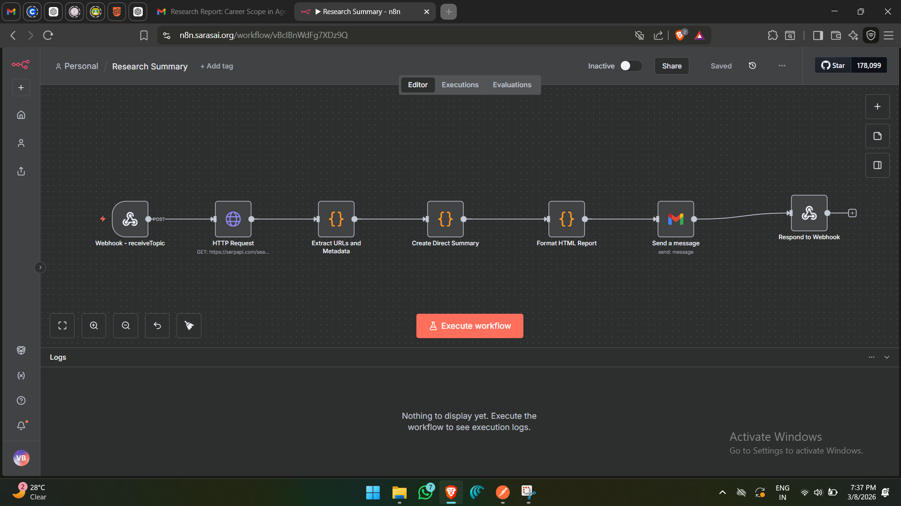
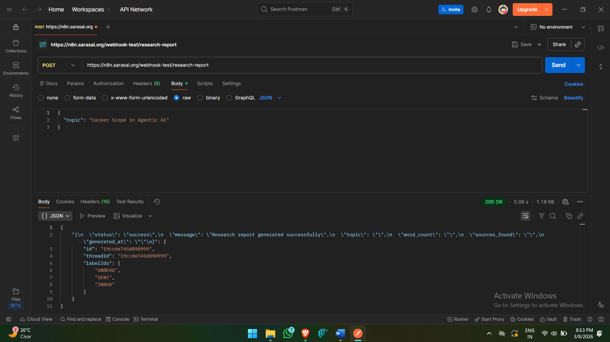

# 🤖 Automated Research Report Generator Using N8N

An AI-powered automation workflow built with N8N that automatically generates structured research reports from any given topic — no manual effort required.

## 🚀 What It Does

- Takes a research topic as input (via API/webhook)
- Automatically searches and gathers relevant information
- Processes and summarizes content using AI
- Generates a clean, structured research report
- Outputs the final report as a JSON/document

## 🛠️ Tools & Technologies Used

- **N8N** — Workflow automation
- **AI/LLM Node** — For summarization and report generation
- **HTTP Request Nodes** — For fetching data
- **Webhook** — To trigger the workflow via API

## 📁 Files in This Repo

| File | Description |
|------|-------------|
| `workflow.json` | N8N workflow — import this directly into your N8N instance |
| `Research Summary.json` | Sample output generated by the workflow |
| `workflow.png` | Visual overview of the workflow |
| `postman_screenshot.png` | API trigger demo via Postman |

## ⚙️ How to Use

1. Clone this repo
2. Open your N8N instance
3. Go to **Import Workflow** → upload `workflow.json`
4. Set up your API keys (OpenAI / Gemini etc.)
5. Trigger via Postman or any HTTP client using the webhook URL
6. Get your research report instantly ✅

## 📸 Workflow Preview

## 🔗 API Trigger (Postman)

---

Built with ❤️ using N8N + AI
